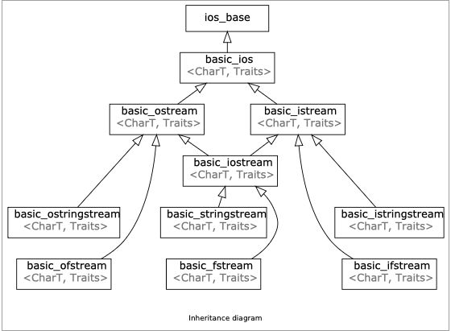

# Streams

## What are streams

“为编程语言设计和实现一个通用的输入/输出设施是出了名的困难。”

- Bjarne Stroustrup

**Streams:** a general input/output(IO) **abstraction** for C++

**抽象**通常提供一个一致的*接口*，在**Streams**的情况下，*接口*用于**读取和写入数据**

## `cout` and `cin`

Known as the standard `iostreams`

- `cerr` & `clog`
  - `cerr`：用于输出错误信息。
  - `clog`：用于非关键事件的日志记录。

### `std::cout` and the IO library



A familiar stream:

```cpp
std::cout << “Hello, World” << std::endl;
```

`std::cout`是一个流；`std::cout`流是`std::ostream`的实例，它代表标准输出流。

### An Input Stream

一个例子：

```cpp
#include<bits/stdc++.h>
using namespace std;

int main(){
    string initial_quote = "Bjarne Stroustrup C makes it easy to shoot yourself in the foot";
    stringstream ss(initial_quote);
    string first;
    string last;
    string language,extracted_quote;
    ss>>first>>last>>language>>extracted_quote;
    std::cout << first << " "<< last << " said this: "<< language << " " <<extracted_quote << std::endl;
    return 0;
}
```

#### Use `getline`

```cpp
istream& getline(istream& is, string& str, char delim)
```

- getline()函数从输入流`is`中读取字符，直到遇到分隔符字 `delim`，并将其存储在缓冲区`str`中。
- 默认情况下，分隔符字符delim是`\n`（换行符）。
- getline()函数**消耗**了分隔符字符（delim）。

例如：

```cpp
getline(ss,extracted_quote,'\n');
```

## Output streams

- 向目标/外部源写入数据的方法
  - 例如将某些内容写入控制台（`std::cout`）
  - 使用 << 运算符将数据发送到输出流

## Input streams
